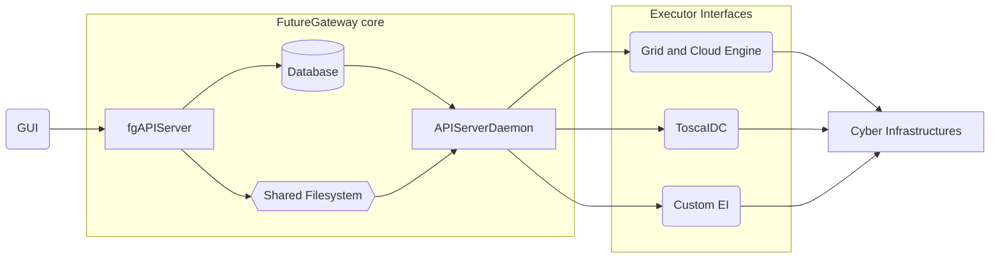
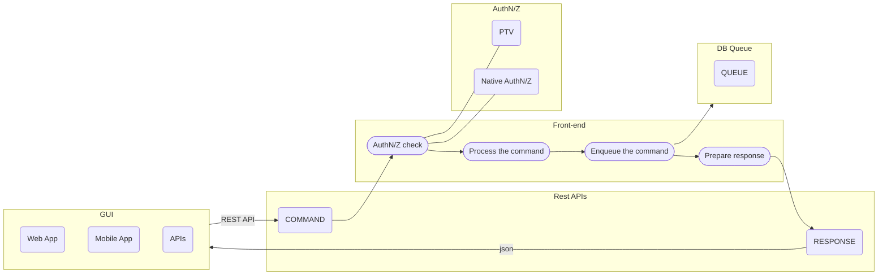
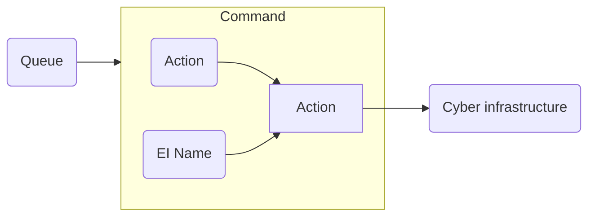

# Mermaid Graphs

Mermaid graphs in the site are generated manually by the mermaid live editor: https://mermaid-js.github.io/mermaid-live-editor

# Architecture

## 1st Graph: Overall graph

## 2nd Graph: API processing flow

## Third graph: Queue command

